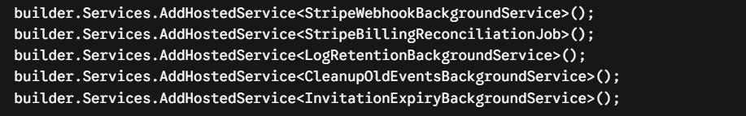

This architectural blueprint outlines how multi-tenancy rules, dynamic permission evaluation, global action filters, and automated background workers operate synchronously within SaaSKit.

---

## 🛂 1. RBAC & Dynamic Permission Engine

SaaSKit utilizes an action-based, highly granular Role-Based Access Control (RBAC) system. Instead of checking static roles inside endpoints, the system enforces individual permission capabilities evaluated dynamically across changing tenant boundaries.

### 🔑 Machine-Safe Key Generation
To keep data consistency, all human-readable roles and permissions are processed through an explicit key normalization pipeline before database insertion.
* Converts strings to **lowercase**.
* Normalizes Unicode sequences and **strips accent marks / diacritics**.
* Converts spaces and special characters into clean underscores (`_`).
* Collapses repeated underscores and trims edge parameters.

| Human Readable Input | Machine-Safe Key Output |
| :--- | :--- |
| `Access To Admin` | `access_to_admin` |
| `Email Settings Read` | `email_settings_read` |
| `Add Car` | `add_car` |
| `Tickets Send Support Ticket` | `tickets_send_support_ticket` |

### 🚨 Architectural Naming Convention Constraint
There is a strict, critical distinction between seed-level authorization configurations and dynamically generated runtime permissions:

* **DbSeeder Permissions:** Initial infrastructural permissions seeded programmatically directly into the data source utilize dot notation boundaries (e.g., `email_templates.read`, `subscription.upgrade`, `stripe.checkout.create`).
* **Dashboard-Created Permissions:** Any permission added dynamically via the administrator dashboard GUI will strictly replace spaces/special characters with **underscores (`_`)**. No dot notation is permitted during frontend configuration injections.

For instance, if an administrator creates a permission titled `Add Car` from the web dashboard panel, the system normalizes the key strictly to `add_car`. Consequently, the backend controller endpoint protecting that resource must leverage matching architecture:

[HttpPost("addCar")]

[Authorize(Policy = "add_car")]


## 🌱 Infrastructure Seeding & Permission Scoping
During the database instantiation sequence managed by DbSeeder, core application components, static layout frameworks, and identity foundations are securely provisioned.

👥 System Role Foundations
The application instantiates two immutable system roles linked directly to the master host workspace (00000000-0000-0000-0000-0000000000ff):

Super Admin (super_admin): Granted global administrative capability via the master bypass token (admin.full_access).

Admin (admin): Assigned a comprehensive bundle of tenant-level operational claims.

🛡️ Permission Scope Allocation Rules
Every permission registered inside the system maps directly to an explicit PermissionScope enumerator configuration, which controls availability layout boundaries:

PermissionScope.System: These permissions are strictly confined to system users operating under the master global realm (e.g., plan.create, tenants.read, features.create). They cannot be visualized, assigned, or manipulated by standard tenant administrators.

PermissionScope.Tenant: Cross-compatible capabilities available to both standard tenant environments and the system workspace (e.g., user.read, role.create, invoice.read).

<Warning>
  **🚨 IMMUTABILITY GUARD RULE:** All seed-level role records and permission parameters initialized with `IsSystem = true` are locked. The engine completely blocks deletion or modification tasks on these entities to guarantee continuous application integrity.
</Warning>


## 🎯 2. Global Action Filters & Interceptors

Cross-cutting system concerns, immutable security auditing, activity tracing, and real-time user alerting are handled completely via ASP.NET Core Action Filters. These filters run globally but trigger dynamically based on custom attributes placed over endpoint methods.


🔐 [AuditLog] Filter

This filter creates an unalterable paper trail of critical data mutations.

Attribute Parameters: [AuditLog("Action Description", EntityName = "TargetEntity")]

First Parameter: Declares the explicit description of the mutation (e.g., "Create Role").

EntityName: Defines the structural entity type being modified (e.g., "Role").

Hierarchical Settings Check: Before writing to the database, it queries the active workspace's AdvancedSettings. If audit logging is disabled for that specific tenant, it immediately checks the global System Settings. If the system switch is enabled but the tenant has it turned off, the log is written globally but marked as decoupled from that specific tenant (TenantId = null).

Execution Boundary: It prepares a pending log data structure before execution but only commits to the database if the endpoint returns a successful 2xx HTTP status code. If the request throws an exception or returns a client/server error (4xx/5xx), the log transaction is safely aborted.


👤 [ActivityLog] Filter

Tracks user interactions and behaviors for security auditing and session history tracing.

Attribute Parameters: [ActivityLog("Action Description", EntityName = "TargetEntity")] (e.g., [ActivityLog("User Login", EntityName = "User")]).

Metadata Enrichment: Beyond baseline identity tracking, this filter extracts environmental client fingerprints directly from the current HttpContext connection headers:

IP Address: Resolves and maps the user's remote IP network location.

User-Agent: Parses and writes the full browser, framework, and OS signature string.


🔔 [Notification] Filter 

A globally registered filter that automatically produces application-level alerts following successful system changes without polluting business services.

Execution Guard: If the invoked endpoint does not contain the [Notification] attribute, the filter skips processing. If present, it waits for a successful 2xx HTTP response with no uncaught exceptions before compiling the payload.

Context Resolution Routing:

TenantId Resolution Priority: Maps via IHasTenant argument -> UseEntityIdAsTenantId data extraction -> ITenantIdProvider.CurrentTenantId context fallback.

UserId Resolution Priority: Maps via RecipientRouteKey route parameters -> defaults to the actively authenticated caller.


⚙️ Attribute Configuration Properties
The [Notification] attribute exposes specialized configurations to dynamically alter the text layout, targeting, and contextual routing during the intercept phase:

Title: Explicitly defines the primary header of the notification. If omitted, the system falls back onto a default baseline header.

Message: Explicitly sets the main notification body text. If this parameter is left unconfigured, the filter automatically scans the incoming HTTP response model properties looking for message or Message keys. If no body content is resolved from the payload, it sets the message value identical to the Title.

Type: Maps the visual classification variant utilizing the NotificationType structural enumerator state (e.g., NotificationType.Success, NotificationType.Error, NotificationType.Warning).

IsTenantScoped: Boolean flag managing systemic delivery context. When configured as true, it flags the pipeline that the notice belongs to the collective workspace rather than an isolated persona.

RecipientRouteKey: Used when IsTenantScoped = false. It instructs the filter to capture a specific parameter string from the route arguments or incoming method signatures (such as "userId") to track down the targeted user identity.

UseEntityIdAsTenantId: Overrides ambient tenant discovery. Forces the filter to capture the unique tracking ID from the mutated data model or response structure and apply that parameter as the active destination TenantId.

TitleResultProperty: Instructs the engine to dynamically extract the notification header title text straight out of the successful HTTP response body properties at runtime.


#### 🗂️ Key Core Notification Scopes & Scenarios

The database state behavior changes dynamically depending on the resolved payload matrix:

| Resolved UserId | Resolved TenantId | Architectural Behavior & Scope |
| :--- | :--- | :--- |
| null | Guid | **Broadcast Tenant-Wide:** The notification targets the entire tenant organization. Every user currently attached to that specific workspace will receive and visualize the alert. |
| Guid | Guid | **Tenant-Scoped User Alert:** Targets an individual user strictly inside that specific tenant workspace. The alert persists only while operating under that workspace boundary. |
| Guid | null | **Global User-Specific Alert:** Private user alert decoupled from any active workspace. Follows the user identity globally across the entire platform ecosystem. |


📝 Implementation Variations & Examples
1. Default Behavior (Dispatches directly to the caller within active context)

[Notification("Stripe settings updated", Type = NotificationType.Success)]

2. Tenant-Wide Broadcast (Dispatches to everyone in the workspace, setting UserId to null)

[Notification("Subscription upgraded", IsTenantScoped = true)]

3. Targeted Route Recipient (Dispatches to an individual user defined in route parameter variables)

[Notification("User disabled", RecipientRouteKey = "userId")]
public async Task Disable(Guid userId)

4. New Entity as Tenant Boundary (Extracts the newly generated entity ID as the target TenantId parameter)

[Notification("Tenant created", IsTenantScoped = true, UseEntityIdAsTenantId = true)]

5. Dynamic Title From Response Payload (Reads the successful response body properties to map the client header dynamically)

[Notification("User updated", TitleResultProperty = "notificationTitle", RecipientRouteKey = "userId")]


## 🛡️ 3. System Guard Filters (Endpoint Barriers)
SaaSKit protects sensitive pipelines from runtime infrastructure failures by placing targeted guard attributes over controller methods. These filters run during the authorization phase and short-circuit requests with a 403 Forbidden object if environment setups are incomplete.

[BillingEnabled] Inspects the platform's global AdvancedSettings. If EnableBilling is configured as false, the filter blocks request processing instantly to avoid broken workspace billing states.

[StripeEnabled] Evaluates active gateway states. If EnableStripe is false or secret environment gateway keys are missing, all lower financial pipeline triggers are gracefully blocked.

[StorageSettingsRequirement] Monitors active file stream uploads (IFormFile). If the core integration mapping profile returns isConnected == false, operations are blocked before file storage client initialization failures can trigger crash dumps.

[EmailSettingsRequirement(SystemSettingsAllowed = true)] Guards automated communication dispatch routes (e.g., invitation paths). If the active tenant workspace has not configured an independent SMTP/API mail node, setting SystemSettingsAllowed = true permits a safe fallback to the master application node. Otherwise, the request is denied to prevent silent mail drops.


## ⚙️ 4. Enterprise Background Services (Hosted Workers)
To maximize runtime throughput and maintain database consistency without blocking the synchronous HTTP response loop, SaaSKit relies on dedicated IHostedService long-running workers.

<Frame caption="Services">
  
</Frame>


🧠 Deep Worker Specifications
🔌 Stripe Webhook Asynchronous Processor
Execution Boundary: Polls every 5 seconds.

Core Mechanics: Decouples direct webhook ingestion from business processing workflows. Instead of processing raw requests inline, incoming Stripe webhook payload packets are immediately dumped into a persistent queuing table. The background processor pulls batches sequentially, deserializes the JSON schema, runs matching workspace data modifications inside isolated database transactions, and manages incremental failure retry counts.

💳 Stripe Billing Reconciliation Engine
Execution Boundary: Executes periodically every 2 minutes.

Core Mechanics: Acts as a self-healing financial data layer. It sweeps the database logs for unbilled system workspace registration milestones and polls remote Stripe API invoices. If local invoice records are dropped due to network issues or late webhook delivery, this worker automatically backfills and updates the missing records.

🧹 Multi-Tenant Log Retention Service
Execution Boundary: Runs on an automated 8-hour tick loop.

Core Mechanics: Enforces custom retention schedules. It evaluates individual tenant configuration profiles, looks up their defined LogRetentionDays limit, and purges older records from the AuditLog and ActivityLog schemas to prevent unbounded database database storage inflation.

🕒 Token Event Cleanup Worker
Execution Boundary: Executes on a strict 1-hour recurring timer.

Core Mechanics: Automatically purges records from the operational webhook tracking table that are older than 1 hour, maintaining lean operational data scopes.

✉️ Invitation Expiry Worker
Execution Boundary: Sweeps once every hour.

Core Mechanics: Queries the active database for outstanding pending invitation instances. If the calculated token time parameter has passed its intended lifespan boundary, it marks the entity as expired to protect link access.


## 🏢 5. Tenant Provisioning & Subscription Onboarding

The onboarding pipeline manages infrastructure binding and subscription initialization when a new workspace is provisioned.

### 🛂 Automated Admin Role Assignment
When a user provisions a new tenant workspace and initiates a subscription sequence, the core engine automatically assigns the **Admin (`admin`)** role to that user. This ensures the onboarding creator immediately obtains full operational permission claims and management control inside their newly isolated tenant boundary.

### 💳 Stripe Checkout & Renewal Plan Customization
Within the `StripeService` layer, the checkout routing governs the subscription trial initialization:
* **Default Workflow Execution:** Inside the `CreateTrialCheckoutSessionAsync` function, the setup programmatically targets the pre-configured `"Standard"` plan as the automated renewal plan at the end of the free trial period.
* **Developer Customization Scope:** This configuration is completely flexible. If you create alternative structures, pricing tiers, or customized tiers, you can easily change or swap this target plan inside the service methods to match your specific application ecosystem requirements.

<Warning>
  **🚨 CRITICAL CUSTOMIZATION STEP:** Once you define and deploy your own customized pricing structures or custom tiers in the dashboard, **DO NOT FORGET** to modify this section in your service code to match your new active plan naming conventions. Leaving the default configuration intact will cause initialization drops if the target plan does not exist.
</Warning>


### 🗄️ Multi-Tenant Data Isolation (EF Core Query Filters)

When extending the platform infrastructure or implementing custom custom entities, you must enforce strict database-level boundaries to prevent data leaks across workspaces. SaaSKit handles this natively via Entity Framework Core Global Query Filters.

If your new entity is tenant-specific, you **MUST** configure the automated tenancy evaluation filter inside your `ApplicationDbContext` initialization pipeline:

```csharp
entity.HasQueryFilter(e => _tenantIdProvider.IsSystemUser || e.TenantId == _tenantIdProvider.CurrentTenantId);

