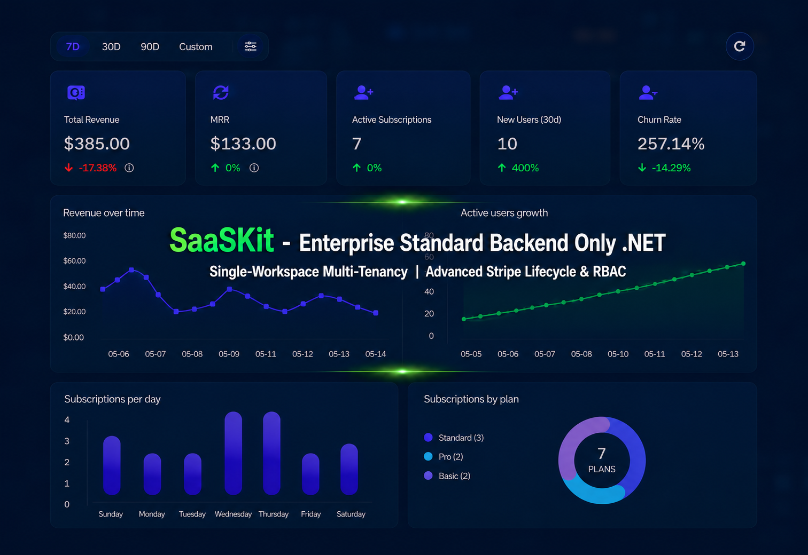

Welcome to SaaSKit, the premier Full-Stack boilerplate engineered for developers who demand robust clean architecture, bulletproof security, and enterprise-grade multi-tenancy. Stop spending months reinventing the wheel. Launch your production-ready SaaS tomorrow with our bulletproof infrastructure.

<Frame caption="SaaSKit'in Profesyonel Gösterge Paneli ve Özelliklerine Genel Bakış">
  
</Frame>

SaaSKit is a battle-tested ecosystem that combines the raw, decoupled power of **.NET Clean Architecture** on the backend with the reactive, high-performance elegance of **Angular** on the frontend. Designed explicitly to eliminate 200+ hours of foundational development, SaaSKit lets you focus 100% on your core business logic.

## Key Core Pillars

We packed SaaSKit with complex enterprise features that usually take months to design, test, and stabilize.

### 🌐 Subdomain-Based Multi-Tenancy

SaaSKit features automated tenant routing mapped directly to the URL hierarchy out of the box. The system dynamically parses subdomains (e.g., `tenant1.pro.saas`, `tenant2.pro.saas`) to isolate workspaces instantly, providing a fully tailored experience for every single tenant.

### 🎨 Enterprise White-Labeling & Full Custom Branding

Empower your business users with native white-labeling capabilities to make the platform completely their own. Tenants can fully control their identity through the **General Appearance Settings**:

* **Complete Visual Control:** Dynamically set tenant logos, custom dashboard background colors, primary brand colors, and global font families.
* **Localization Settings:** Configure custom app names, global date formats, and localized timezones unique to each workspace.
* **Asset & Email Delivery Networks:** Easily configure custom CDN assets for storage isolation and native SMTP/Email configuration values directly from the admin panel.

**Custom Branded Email Templates:** Tenants have dedicated controls to fully style their outbound communications. They can independently set the custom font family, background color, and primary brand color specifically for their email templates. The system dynamically injects these styles along with the tenant's logo during email generation, delivering a uniquely branded template for every send.

### 🔌 Seamless Enterprise Integrations

SaaSKit provides native infrastructure panels to link your external services securely under the **Integrations** engine:

* **Advanced Stripe Settings:** Instantly map and customize payment channels, connect price keys, and toggle billing behaviors within a couple of clicks.
* **Email Settings:** Setup global or tenant-specific email servers. Once configured, the platform utilizes these exact credentials to send personalized, fully branded email templates to external clients.

### 💳 Bulletproof Stripe Subscription Lifecycle

Go lightyears beyond a simple checkout button. SaaSKit features a flawless, automated subscription engine handling the absolute full lifecycle of SaaS billing:

* **Advanced Subscription Operations:** Instant support for Upgrade, Downgrade, Resume, Pause, Cancel at Period End, and Cancel Immediately.
* **Smart Financial Safeguards:** Automated customer balance refunds for paused or immediate cancellations.
* **100% Accounting Precision:** Built-in Invoice, Payment, Transaction, and Order Generation.
* **Stripe Billing Reconciliation Job:** A fail-safe background service that guarantees database sync and accurate accounting even in the event of transient network drops or database timeouts.
* **Real-Time Webhook Engine:** Instant data synchronization between Stripe and your local DB-achieving lightning-fast, zero-refresh UI updates.

### 🛂 Action-Based, Permission-Driven RBAC

Security is baked into the foundation. Our Role-Based Access Control (RBAC) relies on exact permission checks:

* **UI-Level Security:** Users without explicit read permissions are restricted from even seeing specific pages.
* **API-Level Enforcement:** Fine-grained actions (Add, Update, Delete) are strictly bound to permissions, locking down unauthorized API interactions instantly.

### 🔔 Real-Time Notification & Advanced Auditing

* **Live Notifications:** An app-wide live notification engine powered by customizable endpoint filtering, allowing users to toggle exactly which events trigger a notification.
* **Audit & Activity Logs:** Full-scale user activity tracking and secure audit logs to monitor critical operations across the entire tenant workspace.

## Advanced Workspace Customization

SaaSKit includes built-in settings panels designed to scale your operational capabilities from day one:

* **Plan & Price Management:** Add or modify subscription plans directly through the admin dashboard by binding Stripe Price Keys.
* **Secure Invitation System:** Seamlessly onboard team members by sending secure email invitations before adding them to the workspace database.
* **Security Settings:** Give your users total control over their accounts with built-in Two-Factor Authentication (2FA) and profile security management.
* **Billing & Invoice Settings:** Fully manage global billing toggles, handle invoice generation triggers, and define custom invoice prefixes unique to each tenant.
* **Advanced Controls:** Global toggle switches to enable/disable audit logs, or put the entire workspace into a stylized Maintenance Mode.
* **Dual-Sided Support Ticketing:** Tenants can open support tickets to communicate directly with the Super Admin. The Super Admin can respond via targeted emails or broadcast global announcements to all tenants simultaneously.

---

<Note>
  "Every single chart, dashboard component, and architecture choice shown in our visual overview is backed by this rock-solid engine. We didn't just build a template; we built an infrastructure that guarantees your SaaS operates like an enterprise software solution from its very first minute in production."
</Note>
