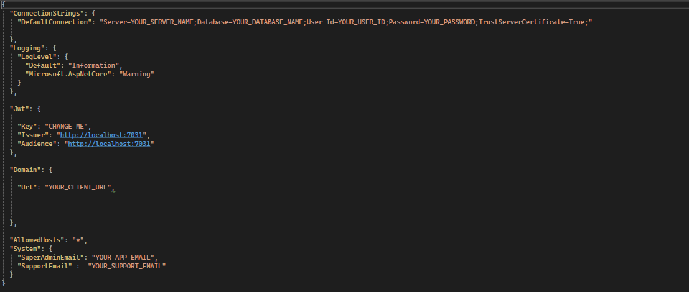
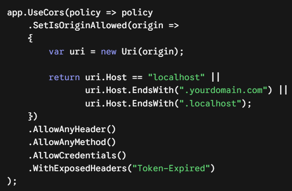
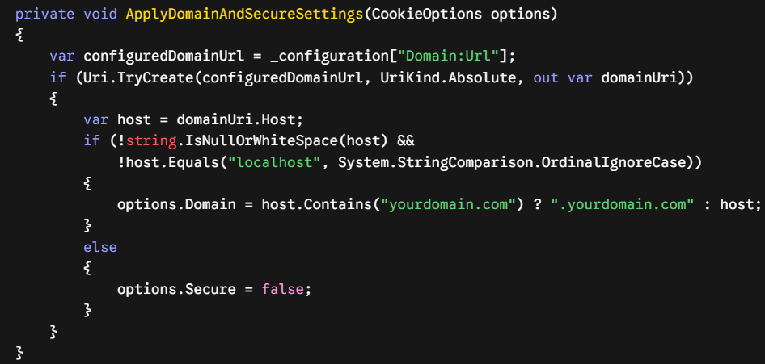

To deploy SaaSKit smoothly, follow this precise sequence to set up your configuration variables, execute your SQL Server migrations, and trigger the automated infrastructure seeding.

## 🛠️ 1. Prerequisites
Ensure your local development environment has the following software installed:

.NET 8 SDK (Latest stable release)

SQL Server (LocalDB, Express, or Enterprise Edition)

IDE / Code Editor of your choice with C# development tools installed

## ⚙️ 2. Setting up appsettings.json
Navigate to your Web API root directory, open the appsettings.json file, and replace the placeholders with your own infrastructure credentials:

<Frame caption="appsettings.json">
  
</Frame>

NOTE 1: The Domain:Url value must match your frontend application's root URL exactly!

NOTE 2: The System:SuperAdminEmail field will be your initial Super Admin account username.

🚨 CRITICAL ARCHITECTURAL REQUIREMENT: ROOT DOMAIN MATCHING

The Frontend Domain Root and API Domain Root MUST share the exact same top-level apex domain. SaaSKit enforces the strict SameSite = Lax cookie policy for authentication tracking; if the root domains do not match perfectly, browsers will block all cross-origin authentication cookies instantly.

Production Example:

API Domain: api.yourdomain.com

Frontend Domain: ui.yourdomain.com

The most important requirement is that yourdomain.com must be exactly the same.

## 🌐 Cross-Origin Resource Sharing (CORS)
Inside `Program.cs`, the CORS policies dynamically evaluate incoming origin strings to securely whitelist the allowed subdomain-based tenant requests while sealing out malicious request injections:

<Frame caption="Program.cs">
  
</Frame>

NOTE 1: Replace .yourdomain.com in the CORS policy with your own root domain address to match your frontend infrastructure.

## 🍪 Cookie Scope Allocation & Lax Security Policy
Within the `TokenService` layout, the `ApplyDomainAndSecureSettings` engine ensures that authentication scopes seamlessly persist across custom tenant subdomains by modifying cookie attributes:

<Frame caption="TokenService.cs">
  
</Frame>

NOTE 1: Ensure you replace "yourdomain.com" and ".yourdomain.com" inside the string evaluation with your own custom apex root domain address.

## 🏗️ 4. Applying Database MigrationsSaaSKit uses Entity Framework Core to orchestrate database modifications. Follow these steps to map the architectural schema directly to your target SQL Server instance:

1. Open your project solution in your preferred IDE.

2. Open the Package Manager Console (via Tools -> NuGet Package Manager -> Package Manager Console).

3. From the Default project dropdown menu inside the console, explicitly select SaaSKit.DataAccessLayer.

4. Run the following standard migration targets to map your schema and create the database:

PowerShell

A. Add-Migration InitialSaaSKitMigration

B. Update-Database

## 🌱 5. Automated Data Seeding Mechanics (DbSeeder)
SaaSKit contains an integrated `DbSeeder.cs` workflow situated directly within the `DataAccessLayer`. When the web API boots for the first time, the engine checks for an empty dataset and programmatically spins up the initial application context.

> 🚨 **IMPORTANT LOCALHOST REQUIREMENT:** You **MUST** launch the backend application locally using the **HTTPS** protocol at least once (e.g., `https://localhost:7031`). This is strictly required for the system to execute the initial setup and successfully write the seed data into your database.

🛂 Root Identity Generation
The seeder captures your declared configuration parameters to provision your global access credentials:

Super Admin Activation: Extracts your entry from "System:SuperAdminEmail". If none is specified, it fallbacks onto superadmin@superadmin.com.

Initial Access Password: Instantiated globally with a default temporary password of Admin123!. Change this credential immediately after logging into your admin panel dashboard.

Support Ticket Matrix: Assigns incoming customer care notifications directly to your custom set "System:SupportEmail" gateway so that all support tickets are tracked successfully.

💾 Core Seed Entities Generated
During execution, the database engine will populate the following structural system constants:

Default Tenant Context: Configures the baseline tenant record used by the application and links your Super Admin account directly to it during the initial setup.

Global App Settings & Themes: Deploys initial layout values utilizing a primary Indigo skin (#4f46e5), Raleway typography frameworks, and defaults localized system structures (UTC, USD, yyyy-MM-dd).

SaaS Billing & Security Configurations: Toggles internal global states including default 14-day trials, standard billing switches, strict maximum sign-in limitation caps, and automatic internal system prefixing rules (INV).

Action-Based Permission Engine: Maps out critical role operations including detailed fine-grained capability checks such as `subscription.upgrade`, `stripe.checkout.create`, `audit_log.read`, and tenant-management related policies.

🛂 Initial Super Admin Credentials
The seeder captures your declared configuration parameters inside appsettings.json to provision your default root access profile:

Username / Email: The exact value configured in your "System:SuperAdminEmail" field (e.g., admin@yourdomain.com). If left empty, it will default to superadmin@superadmin.com.

Default Password: Instantiated globally with the default static password Admin123!.

Support Ticket Matrix: Assigns incoming customer care notifications directly to your custom set "System:SupportEmail" gateway so that all support tickets are tracked successfully.

## 🧩 6. Architecture & System Logic Overview
Beyond foundational parameters, SaaSKit's backend layer follows a highly decoupled approach designed to keep your business workflows distinct from presentation constraints. Let's delve into the architectural design supporting our billing mechanics, logging frameworks, and real-time messaging subsystems in the next sections.

