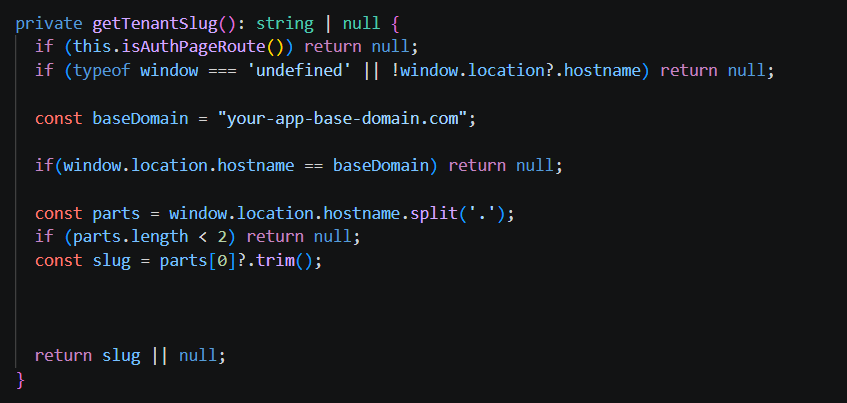

Follow this precise sequence to configure your production settings, manage client-side security barriers via route guards, integrate menu permissions, and initialize your production deployment pipeline.

---

## 🛠️ 1. Prerequisites & Build Operations

The frontend client is built upon a modular architecture designed to support system operators, tenant-aware routing, and environment-specific configuration.

### 📦 Installation
Navigate to your Angular project application root directory and restore all third-party structural packaging assets:


npm install


🚀 Production Compilation

To bundle, optimize, and tree-shake your static client layout resources for high-speed live distribution, compile the production release:

npm run build


## ⚙️ 2. Production Environment Configuration

Angular tracks live environment-specific endpoint parameters inside the isolated src/environments/environment.development.ts configuration file. Update this structure prior to launching deployment scripts.

export const environment = {

  apiUrl: 'https://api.saasengine.dev/'
};


## 🗺️ Public Wildcard DNS Mapping Rules
When registering your production deployment profiles inside your cloud server routing engine or public DNS manager (e.g., Cloudflare, Route 53), you MUST instantiate two separate pointer configurations:

The Apex Application Record (A / CNAME): Maps your naked root frontend portal.

Host: app.saasengine.dev -> Points to: Live Frontend Application Server IP/Host.

The Wildcard Application Record (CNAME / A): Intercepts and tunnels all tenant subdomains instantly.

Host: *.app.saasengine.dev -> Points to: Same Frontend Application Server IP/Host.


## 🔌 Subdomain Tenant Resolver
Once the wildcard DNS tunnels the incoming stream down to your frontend application server, the global client `auth.interceptor.ts` intercepts the request execution context. It evaluates the host metadata array to parse out the leading tenant identifier and injects it into headers before hitting backend systems.

To execute host evaluation tasks properly, the interceptor relies on an internalized structural parsing method:


<Frame >
  
</Frame>

🧠 Operational Subdomain Resolution Flow
The context extraction strategy operates under a strict verification lifecycle when evaluating the current address parameters:

Authentication Boundary Check: If the user is operating strictly inside an excluded auth path structure (isAuthPageRoute()), context evaluation aborts instantly, returning null.

Apex Realm Protection: If the executing client location address precisely matches the base domain frontend variable string value (`app.saasengine.dev`), the engine identifies the connection as the root application entry point rather than a tenant subdomain.

Tenant Slug Extraction: If the location contains a subdomain, the array splits on dot boundaries. The primary zero-index value (`parts[0]`) is captured, sanitized, verified against system blacklist keywords, and delivered as the active tenant slug.


#### 🗂️ Architectural Resolution Examples

The layout below illustrates how incoming browser request contexts map to the active tenant context through subdomain resolution:

| Incoming Browser URL | Extracted Slug Route | Resolved Architectural Target Environment |
| :--- | :--- | :--- |
| `https://app.saasengine.dev` | null | **Root Application Entry:** Loaded without a tenant slug when the request comes from the base domain. |
| `https://tenant1.app.saasengine.dev` | tenant1 | **Tenant 01 Context:** The application resolves the `tenant1` slug and loads the corresponding tenant-specific configuration. |
| `https://tenant2.app.saasengine.dev` | tenant2 | **Tenant 02 Context:** The application resolves the `tenant2` slug and loads the corresponding tenant-specific configuration. |


## 🛡️ 4. Client-Side Authentication & Safety Route Guards
To complement backend security frameworks and shield client interfaces before executing unauthorized server operations, the routing engine routes path configurations through client-side barriers.

🛂 Admin Route Guard (AdminAuthGuard)
Target Layout: Secures path segments starting under the core admin boundary (/admin/).

Logic: Prevents standard user roles or unauthenticated contexts from loading workspace dashboard components. It demands a valid identity configuration paired with a recognized internal administrative baseline profile.

👤 Customer Route Guard (CustomerAuthGuard)
Target Layout: Restricts access across self-service spaces (/customer/).

Logic: Verifies active sessions for tenant users or end-consumers, isolating customer profile areas from administrative panels.

💳 Subscription Guard (EnableBillingGuard)
Target Layout: Placed over plan pricing grids, payment checkout views, and renewal workflows.

Logic: Validates active subscription metrics via internal configuration switches. If the platform owner has disabled processing options (EnableBilling == false), the guard short-circuits the transition loop, locking users out of payment collection interfaces.

⚙️ System Administrator Guard (SystemGuard)
Target Layout: Wraps structural operations (e.g., global system setup tabs and master pricing engines).

Logic: Imposes strict identity isolation. Blocks any non-system user from viewing or initializing global configurations.

🛠️ Platform Maintenance Guard (MaintenanceGuard)
Target Layout: Top-level route interceptor layer covering the routing matrix.

Logic: Evaluates global engine availability flags. When active maintenance operations are initialized, it prevents standard users from proceeding further into the client layout. It diverts incoming web requests smoothly onto an isolated placeholder screen (/maintenance), while simultaneously allowing system operators to pass through safely.

## 🗂️ 5. Permission-Driven Dynamic Navigation UI
To prevent dead interface link rendering and maximize end-user layout experience, navigation rendering relies on an internal configuration filtering engine inside NavigationService.

## 🔑 Menu Mapping & Claim Evaluation Mechanics
Menus declare structural arrays containing unique identifier parameters known as permissionKeys and visibility criteria switches:

Infrastructural Identification Handling: When parsing item configurations, the service evaluates the active user identity's token structure, looking for structural keys matching saved role claim parameters.

Master Authorization Pass: If the active client identification profile contains the global master validation key (admin.full_access), all structural filtering checks skip entirely, and the system renders all components instantly.

System Component Isolation (`systemOnly`): Items explicitly marked with `systemOnly: true` will fail visualization checks if the active identity context operates under a standard tenant context, regardless of standard permissions.

Granular Capability Mapping: If standard granular lists are present (e.g., `permissionKeys: ['user.read']`), the menu item remains hidden until the engine verifies that the active tenant identity context explicitly holds that specific normalized capability.

For example: 
```bash
{
  "id": "users",
  "label": "Users",
  "icon": "people",
  "route": "/admin/users/list",
  "permissionKeys": ["user.read"]
}
